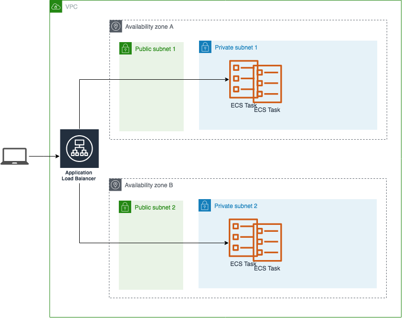

# Amazon ECS CICD pipelines

This repo contains an example of how to create Continuous Integration / Continous Deployment pipelines for a docker based application running on ECS Fargate.

## The application

For the sample application we use a Python Flask based website (Penguin School) taken from this Linux Academy repo:

https://github.com/linuxacademy/cda-2018-flask-app

We use two docker containers running together in the same ECS Task:

- A python 3.5 based Flask application 
- An nginx based reverse proxy side-car container

The flask app container receives traffic from the nginx container which receives traffic from an ALB loadbalancer.

Here is the overall ECS Fargate based architecture:




## The CICD pipelines

We have two types of CICD pipelines, both defined using infrastructure as code with the [Cloud Development Kit](https://docs.aws.amazon.com/cdk/latest/guide/what-is.html).

#### Dev Pipeline

This pipeline does the following

1. Pull from the github repo dev branch
2. In parallel:
   - Build the docker containers and push them into ECR repos
   - Use CDK synth to create a CloudFormation template for the ECS Fargate development environment
3. Deploy a CloudFormation stack based on this template.

#### Staging / Prod Pipeline

This pipeline is manually triggered and does the following:

1. Pull from the github repo master branch
2. Get the latest image tag from SSM parameter and create Cloudformation templates for the ECS Fargate staging and production environments
3. Deploy a Cloudformation staging stack with the image tag as parameter
4. Wait for manual validation before continuing
5. Deploy a Cloudformation prod stack with the image tag as parameter

#### Pipelines Visualized

Once the pipelines have been deployed, you can see a visual representation in the AWS console here:

https://console.aws.amazon.com/codesuite/codepipeline/pipelines

## Getting started

### CDK

We will be using the CDK framework when developing our infrastructure as code and you therefore need to install the framework on your computer. If you have never used CDK before then it is highly recommended to try out this workshop:

https://cdkworkshop.com/

The examples in this repo are based on CDK version 0.32.0 so you either need to install that version or go in and change the CDK packages in the packages.json files to use the versions matching your CDK version.

```bash
npm install -g aws-cdk@0.32.0
```

### Github Repo

The CICD pipelines uses this github repo as source and you should therefore start by forking this repo and clone it on your computer.

The dev pipeline is triggered on each git push so you will need to create a github personal access token with **admin:repo_hook, repo** rights:

https://github.com/settings/tokens

The code of the pipeline fetches this token from the AWS Secrets Manager in your AWS account. Store the github token in AWS Secrets Manager using a secret called for example **github-personal-access-token**. You can create it using the AWS console:

https://console.aws.amazon.com/secretsmanager/home#/listSecrets

or you can create it using the aws sdk:

```bash
aws secretsmanager create-secret --name 'github-personal-access-token' --secret-string mygithubtoken
```

Your github repo, your github owner and the name of your github token AWS secret should be used as config values in the **config.ts** file found in the cdk folder of the repo:

```typescript
export const githubOwner = 'peerjako-aws';
export const repoName = 'cdk-ecs-cicd';
export const gitDevBranch = 'dev'
export const gitProdBranch = 'master'
export const awsSecretsGitHubTokenName = 'github-personal-access-token';
export const ssmImageTagParamName = 'penguinapp-imagetag';
export const stagingValidationEmail = 'validation@test.com';
```

The dev pipeline will pull code based on a dev branch, wheras the staging/prod pipeline will pull code based on the master branch.

### Other config values

##### ssmImageTagParamName

When the dev pipeline has built new docker images (app, nginx) both images are pushed into their ECR repos with an image tag value equal to the git commit value. This image tag is put into the SSM parameter store using a parameter name defined in the ssmImageTagParamName of the config.ts file.

When the staging/prod pipeline is run, it will use the latest image tag value when creating the cloudformation templates defining which docker images to use in the ECS Task definitions. Both the staging and production cloudformation templates will use the same image tag, meaning that once the staging environment has been tested and validated, the production environment will get the exact same immutable release. This minimized the risk of bad suprises when releasing to production.

##### stagingValidationEmail

When a new release has been deployed to the staging environment a validation email is sent to the email address defined in this parameter. When the pipeline is created a subscription validation email is sent to this email address.

### Deploying it all

Click [here](cdk/README.md) for details on how to deploy the Fargate clusters, CICD pipeline and dev, staging and prod environments.

## Known problems

The docker compose file in the root of this repo is currently not working since docker compose services communicates based on service dns names whereas ECS Fargate has containers running in the same task communicate over localhost. Some kind of mechanism for using localhost vs app dns name in the nginx config file (proxy_pass) has to be implemented to make this work.